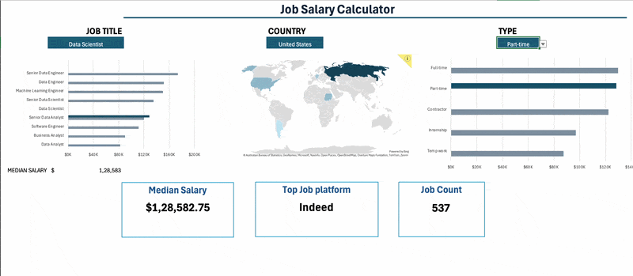

# Excel Salary Dashboard




## Introduction

This Excel Salary Dashboard was created to help job seekers explore salary trends across data-related roles and evaluate whether they are being fairly compensated based on factors such as job title, location, and employment type.

The project uses a real-world dataset from 2023 containing detailed information about data science and related job roles, including salaries, job titles, locations, and required skills. The dashboard demonstrates how Excel can be used to transform raw data into an interactive and easy-to-understand salary analysis tool.

### Dashboard File

The completed dashboard is available in [Dashboard_salary.xlsx](Dashboard_salary.xlsx).

### Excel Skills Used

The following Excel skills and features were used throughout the project:

* **📉 Charts**
* **🧮 Formulas and Functions**
* **❎ Data Validation**

## Data Jobs Dataset

The dataset used for this project contains real-world data science job information from 2023. The dataset is provided through my Excel course and serves as the foundation for the analysis.

It includes detailed information on:

* **👨‍💼 Job titles**
* **💰 Salaries**
* **📍 Locations**
* **🛠️ Skills**

## Dashboard Build

### 📉 Charts

#### 📊 Data Science Job Salaries - Bar Chart


* 🛠️ **Excel Features:** Used a bar chart with formatted salary values to present the data clearly and effectively.
* 🎨 **Design Choice:** A horizontal bar chart was selected to make comparisons between median salaries easier to interpret.
* 📉 **Data Organization:** Job titles were sorted by descending median salary to improve readability and highlight differences between roles.
* 💡 **Insights Gained:** The chart makes it easy to identify salary patterns, with Senior-level positions and Engineering roles generally showing higher median salaries than Analyst positions.

#### 🗺️ Country Median Salaries - Map Chart


* 🛠️ **Excel Features:** Used Excel's Map Chart feature to visualize median salaries across different countries.
* 🎨 **Design Choice:** A color-coded map was used to make differences in salary levels easier to identify geographically.
* 📊 **Data Representation:** The map displays the median salary for each country with available salary data.
* 👁️ **Visual Enhancement:** The geographic visualization makes global salary trends easier to understand at a glance.
* 💡 **Insights Gained:** The map highlights differences in salary levels across countries and provides a quick overview of higher- and lower-paying regions.

### 🧮 Formulas and Functions

#### 💰 Median Salary by Job Titles

```excel
=MEDIAN(
IF(
    (jobs[job_title_short]=A2)*
    (jobs[job_country]=country)*
    (ISNUMBER(SEARCH(type,jobs[job_schedule_type])))*
    (jobs[salary_year_avg]<>0),
    jobs[salary_year_avg]
)
)
```

* 🔍 **Multi-Criteria Filtering:** Checks the job title, country, schedule type, and excludes records where the salary value is zero.
* 📊 **Array Formula:** Uses the `MEDIAN()` function together with a nested `IF()` statement to evaluate an array of salary values.
* 🎯 **Tailored Insights:** Allows the dashboard to return salary information based on the selected job title, country, and employment type.
* **🔢 Formula Purpose:** This formula populates the table below and returns the median salary based on the selected job title, country, and type.

🍽️ Background Table


#### ⏰ Count of Job Schedule Type

```excel
=FILTER(J2#,(NOT(ISNUMBER(SEARCH("and",J2#))+ISNUMBER(SEARCH(",",J2#))))*(J2#<>0))
```

* 🔍 **Unique List Generation:** Uses the `FILTER()` function to remove entries containing "and" or commas while also excluding zero values.
* **🔢 Formula Purpose:** This formula generates a list of unique job schedule types that can be used throughout the dashboard.

🍽️ Background Table


📉 Dashboard Implementation:


### ❎ Data Validation

#### 🔍 Filtered List

* 🔒 **Enhanced Data Validation:** Filtered lists were implemented as data validation rules for the `Job Title`, `Country`, and `Type` selections in the Data tab. This helps ensure:

  * 🎯 User input is restricted to predefined and validated options.
  * 🚫 Incorrect or inconsistent entries are prevented.
  * 👥 The overall usability and reliability of the dashboard are improved.


## Conclusion

This Excel Salary Dashboard demonstrates how raw job-market data can be transformed into an interactive tool for exploring salary trends across data-related roles.

By combining charts, formulas, functions, and data validation, the dashboard allows users to compare salaries based on job title, location, and employment type. It also demonstrates how Excel can be used to organize complex datasets and present meaningful insights in a clear and accessible format.

Overall, this project helped strengthen my ability to work with Excel's analytical and visualization features while creating a practical dashboard that can support career and salary research.
